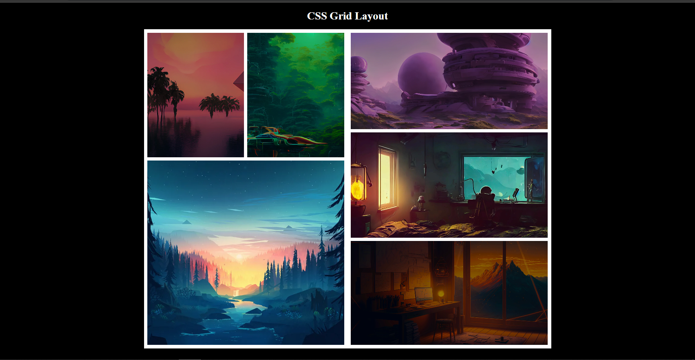

## Web development Mock Test-1

### CSS Grid Layout




### Code

```html

<div class="container">
        <div class="grid-container-1">
            <div class="grid-item item1">
                
            </div>
            <div class="grid-item item2">
                
            </div>
            <div class="grid-item item3">
                
            </div>      
        </div>
        <div class="grid-container-2">
            <div class="grid-item ">
                
            </div>
            <div class="grid-item ">
                
            </div>
            <div class="grid-item ">
                
            </div>      
        </div>
    </div>

```
