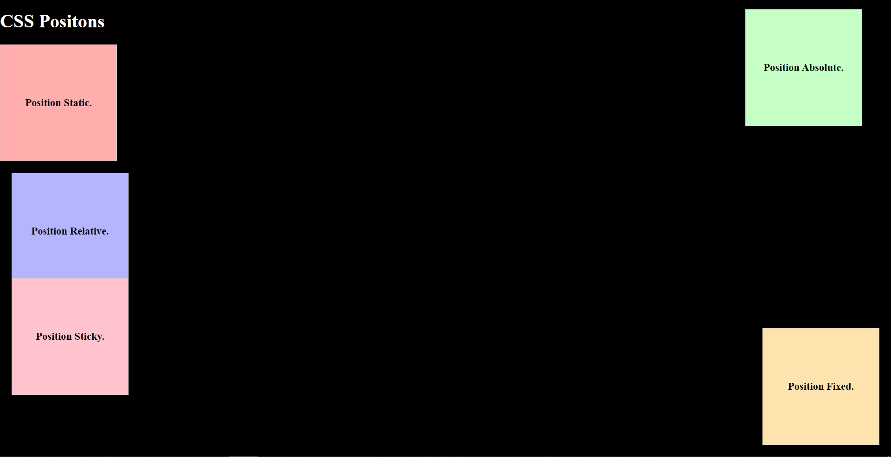

## Web development Mock Test-1

### CSS Positions



**There are 5 types of CSS Position :**

1. **Static**

```css
position: static;
```

Static position is the default position value, an the elements with position value: staticx are positioned accordong to the normal flow of the HTML document.

2. **Relative**

```css
position: relative;
```

When the elements are given the position: relative, the elements are positioned relative to thier normal position.

3. **Absolute**

```css
position: absolute;
```

When an element is given a position absolute, then the element is poistioned relative to the nearest positon parent element ot if there is no parent element the it is positioned relative to the initial conataining block element.

4. **Fixed**

```css
position: fixed;
```

When an element is give a position value fixed, then the element is positioned relative to the viewport  and it does not move even if the page is scroll up and down.


5. **Sticky**

```css
position: sticky;
```

The elements are positioned  based on the user's scroll position.


