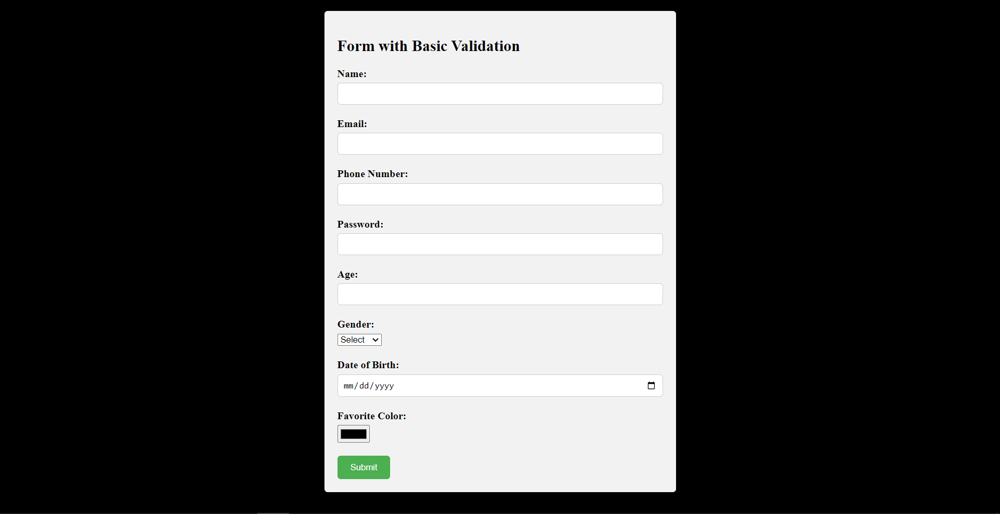

## Web development Mock Test-1

### Form Valiodation 




```html

<form id="myForm" onsubmit="return validateForm()">
        <div class="form-group">
          <label for="name">Name:</label>
          <input type="text" id="name" name="name" required />
          <div id="nameError" class="error-message"></div>
        </div>

        <div class="form-group">
          <label for="email">Email:</label>
          <input type="email" id="email" name="email" required />
          <div id="emailError" class="error-message"></div>
        </div>

        <div class="form-group">
          <label for="phone">Phone Number:</label>
          <input
            type="tel"
            id="phone"
            name="phone"
            pattern="[0-9]{10}"
            required
          />
          <div id="phoneError" class="error-message"></div>
        </div>

        <div class="form-group">
          <label for="password">Password:</label>
          <input
            type="password"
            id="password"
            name="password"
            minlength="6"
            required
          />
          <div id="passwordError" class="error-message"></div>
        </div>

        <div class="form-group">
          <label for="age">Age:</label>
          <input type="number" id="age" name="age" min="1" max="120" required />
          <div id="ageError" class="error-message"></div>
        </div>

        <div class="form-group">
          <label for="gender">Gender:</label>
          <select id="gender" name="gender" required>
            <option value="">Select</option>
            <option value="male">Male</option>
            <option value="female">Female</option>
          </select>
          <div id="genderError" class="error-message"></div>
        </div>

        <div class="form-group">
          <label for="dob">Date of Birth:</label>
          <input type="date" id="dob" name="dob" required />
          <div id="dobError" class="error-message"></div>
        </div>

        <div class="form-group">
          <label for="color">Favorite Color:</label>
          <input type="color" id="color" name="color" required />
          <div id="colorError" class="error-message"></div>
        </div>

        <button type="submit" class="submit-button">Submit</button>
      </form>

```


